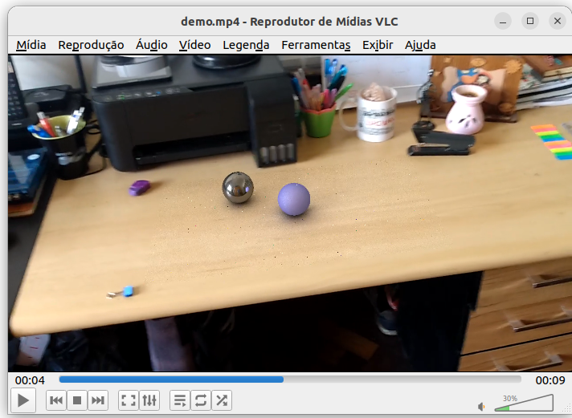

# vfx
Code base for the book <a href="https://www.routledge.com/Introduction-to-Visual-Effects-A-Computational-Approach/Velho-Velho/p/book/9781032072302">Introduction to Visual Effects: A computational approach</a>, also available on <a href="https://www.amazon.com/Introduction-Visual-Effects-Computational-Approach-ebook/dp/B0BSLQ48W4/ref=sr_1_1?crid=3MUGQQUIXWECK&keywords=introduction+to+visual+effects&qid=1704557807&sprefix=introduction+to+visual+effects%2Caps%2C269&sr=8-1">Amazon</a>. It implements: Matchmove, Global Illumination (Pathtracing), and is prepared for making Image Based Lighting in combination of the LuminanceHDR Software. As a result, it can generate simple realistic visual effects.

The user should keep in mind that this software was developed to be used alongside an introductory book that explains the mathematics and algorithms behind the entire VFX pipeline. The solutions implemented prioritize clarity and ease of understanding rather than performance optimization; nevertheless, the software is still capable of producing good and correct results.

Notice
-------------------------
Version v1.1.0 is now live. This update addresses known issues and bugs found in the initial release.

Requirements
-------------------------
cmake, make, gcc, g++, bison, flex, ffmpeg, imagemagick, opencv, openmp, gsl, libpng

Since the frames generated as output of the visual effects program are HDR images, you need to be able to open .pfm files. You can use GIMP to do this, or ImageMagick (convert program) to convert the .pfm images into .png or .jpg files.

Result Example
-------------------------
<p align="center"></center></p>
<p align="center">Two virtual spheres over a captured video.</p>

The complete video can be watched in <a href="https://youtu.be/0dFbJLH55wE">https://youtu.be/0dFbJLH55wE</a>.

Visual Effects Software
=======================

This is the companion software package of the book  <a href="https://www.routledge.com/Introduction-to-Visual-Effects-A-Computational-Approach/Velho-Velho/p/book/9781032072302">
"Introduction to Visual Effects: A computational approach"</a> 
by Bruno Madeira and Luiz Velho.

The software contains an implementation of all the
algorithms described in the book.
It is splitted into two parts: the matchmove software
and the s3d-ptrace software.

The matchmove module has the Computer Vision routines
necessaries for making a successful matchmove procedure. 
The math processing of this module is solved using the 
Gnu Scientific Library.

The s3d-ptrace module has the Computer Graphics routines necessaries
for implementing a Pathtracing and Image Based Lighting processing.
The functions of this module uses as basis the software of the book:
"Design and Implementation of 3D Graphics Systems" from: Luiz Velho,
Jonas Gomes and Mario Costa Sousa.  

Installation and Testing
----------------------------
1) Clone the repository using:
```bash
   git clone https://github.com/visgraf/vfx.git
```
3) Install the required dependencies (OpenCV, GSL, etc.).
```bash
   sudo apt update && sudo apt install -y \
   cmake \
   build-essential \
   bison \
   flex \
   ffmpeg \
   imagemagick \
   libopencv-dev \
   libomp-dev \
   libgsl-dev \
   libpng-dev
```

4) Build and test each module:
   
  - The instructios for building and testing these modules are presented
in the README files inside the directories: ./matchcmove and ./s3d-ptrace.

  - We highly recommend trying the s3d-ptrace demos first.

  - Note: The rendering programs used for the demo of the Cornell Box and for the VFX scenes are configured to produce
high-quality results. If the user prefers faster rendering at the cost of image quality,
they can reduce the number of rays traced per pixel by decreasing the MAX_PTRACE_SAMPLES
macro in the files s3d-ptrace/core/proj/ptrace/main.c and s3d-ptrace/core/proj/mmove/main.c before installing. Defining
MAX_PTRACE_SAMPLES equals to 10 is a good value if you are trying the software for the first time.

Interdependence of the Modules
------------------------------

The scripts of this software have interdependence between them.
In order to simplifying the process of testing, the
input files necessary for running almost all the scripts are available.
The unique exception are the dependence of 
./s3d-ptrace/demo/d2, ./s3d-ptrace/demo/d3 and ./s3d-ptrace/demo/d4
 which depend to the execution of ./s3d-ptrace/demo/d0 before.  
Using the scripts defined on this package the user can generate
  videos like ./video/demo.mp4.

<hr>

<b>Links to the Book:</b>

Amazon: https://www.amazon.com/Introduction-Visual-Effects-Computational-Approach-ebook/dp/B0BSLQ48W4/ref=sr_1_1?crid=3MUGQQUIXWECK&keywords=introduction+to+visual+effects&qid=1704557807&sprefix=introduction+to+visual+effects%2Caps%2C269&sr=8-1

Routledge: https://www.routledge.com/Introduction-to-Visual-Effects-A-Computational-Approach/Velho-Velho/p/book/9781032072302

<hr>

Copyright 2022 - Bruno Madeira & Luiz Velho

